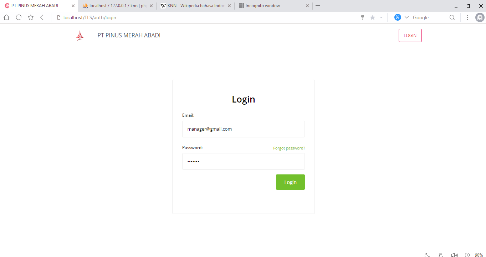
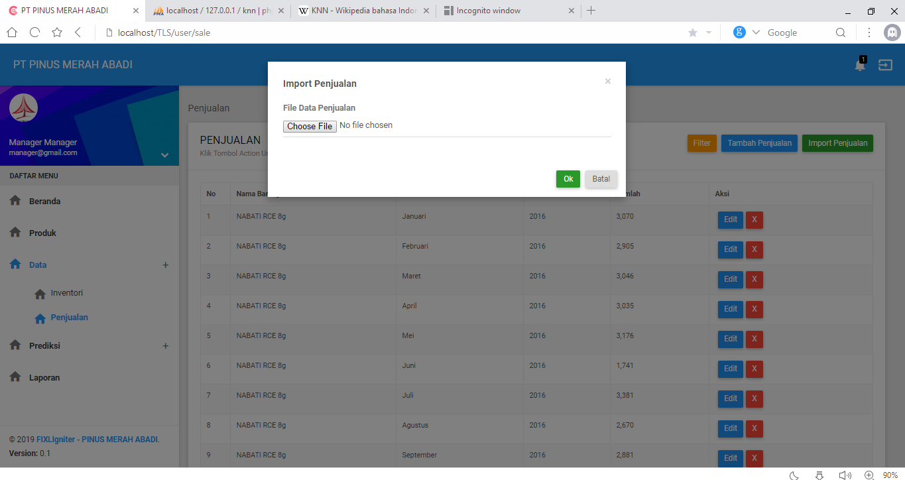
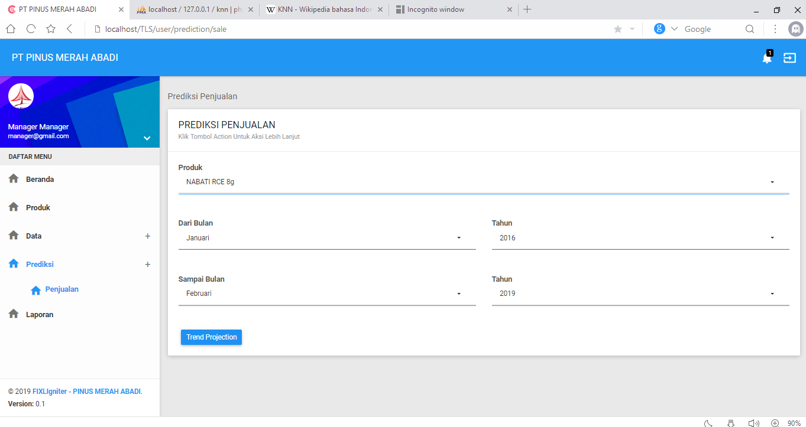
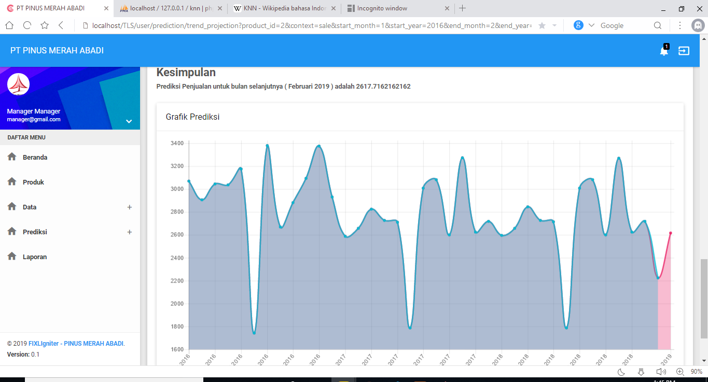

## trend least square
kuadrat terkecil atau yang biasa disebut sebagai metode least square adalah metode peramalan yang menggunakan persamaan linear untuk menemukan garis paling sesuai untuk kumpulan data lampau guna meramalkan data di masa depan.
# Penggunaan
1. login dengan menggunakan Username : `manager@gmail.com`,  pass : `manager`

2. klik menu data/penjualan kemudian import data penjualan ( terdapat pada folder DATA IMPORT )

3. setelah berhasil import, klik menu prediksi/penjualan kemudian klik bulan yang ingin di prediksi

# hasil

